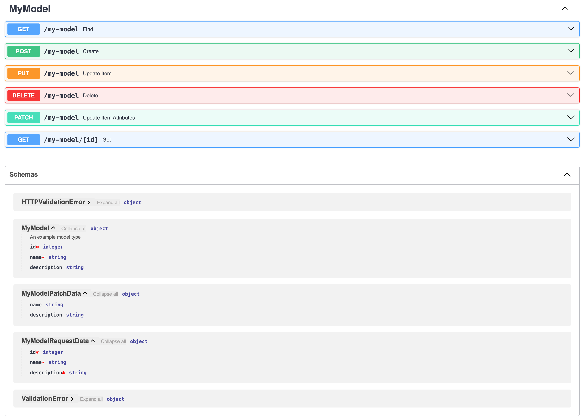

# FastAPI Easy Crud package

This package is the result of a boring saturday. It allows you to create a FastAPI CRUD API with a single line of code
for a given SQLModel type.

The resulting endpoints are:

- **GET /{base_path}/{type_primary_key}**: Get the item with the given primary key. If the type has a composite primary
  key, the path will be /{base_path}/{type_primary_key_1}/{type_primary_key_2}/...
- **GET /{base_path}**: Get all items of the given type. This method supports filtering by any field of the type by
  using query parameters. For example, to filter by the field `name`, you can use the query parameter `name=John`.
- **POST /{base_path}**: Create a new item of the given type. The body of the request must be a JSON object with the
  fields
- **PUT /{base_path}**: Update the item with the given primary key. The body of the request must be a
  JSON object with the fields
- **DELETE /{base_path}/{type_primary_key}**: Delete the item with the given primary key. If the type has a composite
  primary key, the path will be /{base_path}/{type_primary_key_1}/{type_primary_key_2}/...
- **PATCH /{base_path}/{type_primary_key}**: Partially update the item with the given primary key. The body of the
  request must be a JSON object with the fields you want to update

## Usage

You can use it in your FastAPI application like this:

```python
from fastapi import FastAPI
from fatapi_easy_crud import BaseRepository, add_base_crud_endpoints
from sqlmodel import Field, SQLModel

class MyModel(SQLModel, table=True):
    id: int = Field(primary_key=True)
    name: str
    description:str = None


api = FastAPI(title="My API")
add_base_crud_endpoints(
    app=api,
    model_type=MyModel,
    base_path="/my-model",
    repository=BaseRepository(MyModel, engine = ...) # get a SQLAlchemy Engine and pass it as an argument
)
```

start your api and check the endpoints in the swagger documentation:


